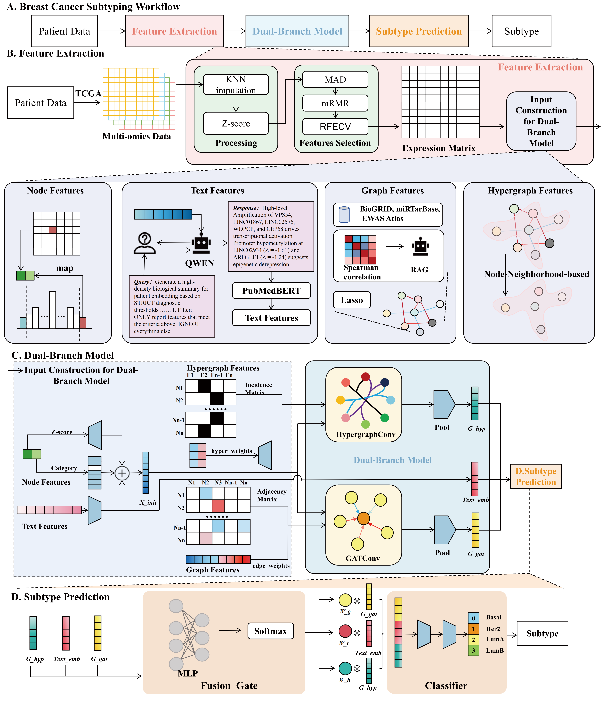

# CancerText

**A Multimodal Hypergraph-Enhanced Framework for Cancer Subtyping Prediction via In-Context Learning**

## Overview



Accurate cancer subtyping is critical for precision oncology, yet existing deep learning methods often struggle to capture high-order interactions within heterogeneous multi-omics data. To address this, we propose **CancerText**, a multimodal hypergraph-enhanced framework for cancer subtyping prediction via in-context learning, which integrates mRNA, miRNA, DNA methylation, and copy number variation into a unified representation. 

Omics features are encoded as contextualized textual sequences to enable in-context learning of cross-modal dependencies, while patient-specific graphs and hypergraphs are simultaneously constructed to model both pairwise relationships and high-order correlations. Specifically, the hypergraph framework is further equipped with an adaptive gating mechanism to weight multimodal contributions dynamically. 

Extensive experiments on breast cancer benchmarks demonstrate that CancerText consistently outperforms state-of-the-art methods, notably achieving an F1 score improvement of **17.9%** for four-class subtyping and maintains stable performance across all metrics, even in challenging binary tasks involving highly similar subtypes. These results highlight the robustness and effectiveness of CancerText in capturing complex molecular heterogeneity for reliable cancer subtyping.


##  Environment Requirements

This project relies on **Python 3.14** and **R**. Please ensure you have the following dependencies installed.

### Python Dependencies
The core framework is built with PyTorch and PyTorch Geometric.

```bash
# Basic Scientific Packages
pip install numpy==2.3.5 pandas==2.3.3 scikit-learn==1.7.2 tqdm==4.67.1

# Deep Learning Framework
pip install torch==2.9.1
pip install torch-geometric==2.7.0

# LLM & Feature Selection Utilities
pip install openai==2.8.1
pip install python-dotenv==1.2.1
pip install mrmr-selection==0.2.8